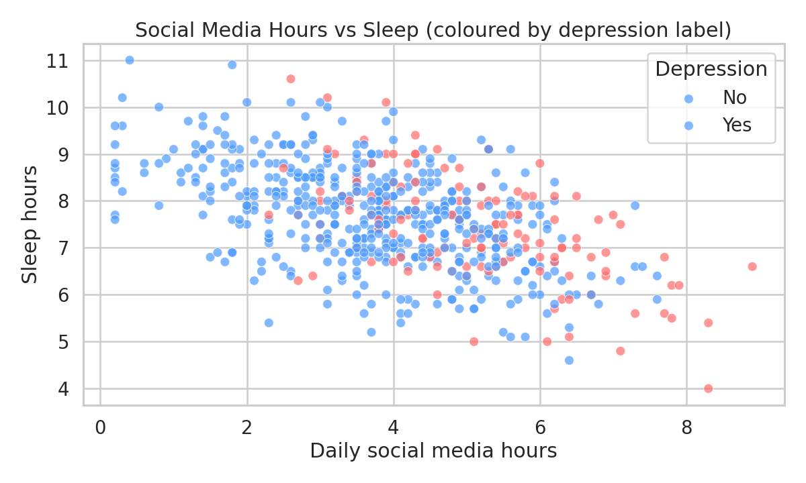
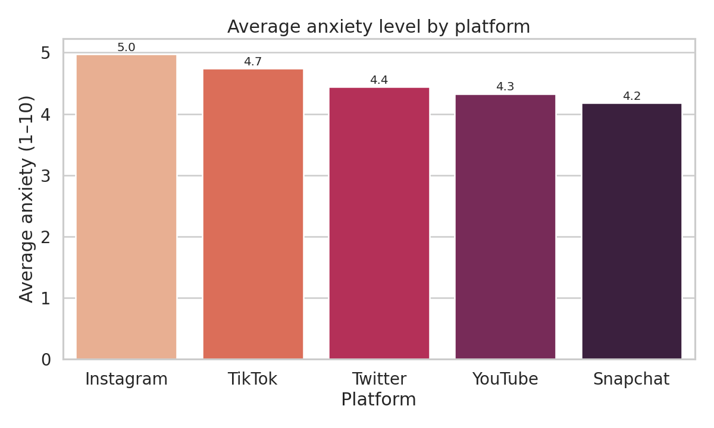
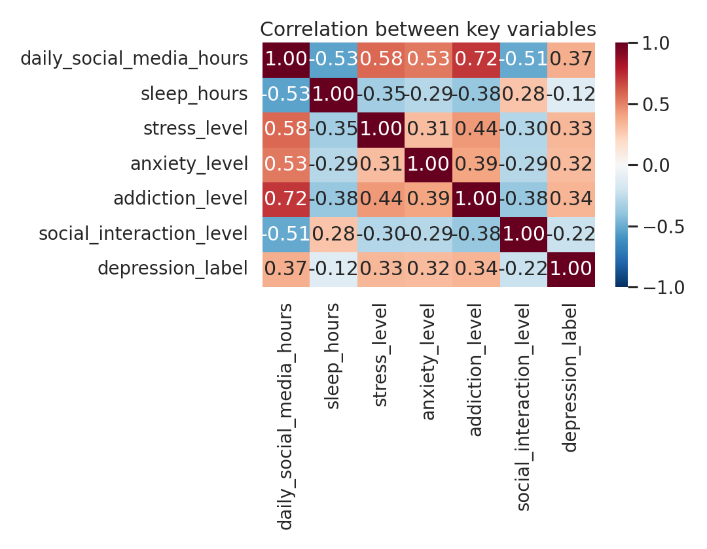

# 📊 Teen Social Media & Mental Health

Exploratory data analysis of how time spent on social media relates to sleep, anxiety and depression in teenagers (ages 13–18).

> **Question:** Is the time teenagers spend on social media associated with worse sleep, higher anxiety and a higher risk of depression? Are some platforms worse than others?

---

## 🔑 Key findings

- 📉 Teens spending **>5 hours/day** on social media sleep on average **6.9 h**, vs **8.6 h** for those with ≤2 h/day — a **1.7-hour deficit**.
- 😰 **Instagram** and **TikTok** users report the highest average anxiety (4.98 and 4.74 / 10).
- 🚨 The depression rate jumps from **22% overall** to **44%** among heavy users (>5 h/day).
- 🛡 **Offline social interaction** is the strongest protective factor in the dataset.

---

## 📈 Visualisations

### 1. Social media hours vs sleep


More time on social media is linked to less sleep. Red dots (depressed teens) cluster in the bottom-right — high social-media use and low sleep tend to appear together.

### 2. Anxiety by platform


Instagram and TikTok lead. **Caveat:** their users also spend the most time on the app, so the platform effect may simply be a *time* effect.

### 3. Correlation heatmap


Daily social media hours is the variable most strongly correlated with the depression label (+0.37).

---

## 🛠 Tech stack

- **Python 3.10+**
- **pandas** — data wrangling
- **matplotlib / seaborn** — visualisations
- **Jupyter Notebook** — analysis environment

---

## 📂 Project structure

```
teen-social-media-analysis/
├── README.md                  # this file
├── analysis.ipynb             # main analysis notebook
├── requirements.txt           # exact dependencies
├── .gitignore
├── data/
│   └── teen_mental_health.csv # 600 rows of teen survey data
└── images/                    # exported charts for the README
    ├── 01_social_media_vs_sleep.png
    ├── 02_anxiety_by_platform.png
    └── 03_correlation_heatmap.png
```

---

## ▶️ How to run

```bash
git clone https://github.com/<your-username>/teen-social-media-analysis.git
cd teen-social-media-analysis
pip install -r requirements.txt
jupyter notebook analysis.ipynb
```

---

## 🎯 Conclusions

1. **Total time** on social media matters more than *which* platform — the 5 h/day mark is a useful red flag.
2. **Offline interaction** appears protective and deserves more attention than blaming specific apps.
3. **Caveats:** the data is observational (correlation ≠ causation), the depression label is self-reported, and the sample (n = 600) is modest. A follow-up should use longitudinal data and clinical depression assessments.

---

## 📜 Data source

Synthetic educational dataset based on patterns reported in the literature on teen social media use and mental health. Not real patient data.

---

## 👤 Author

Mykyta Heorhanov — [LinkedIn](https://www.linkedin.com/in/mykyta-heorhanov-a8131040a/) — [GitHub](https://github.com/dipoqq)
